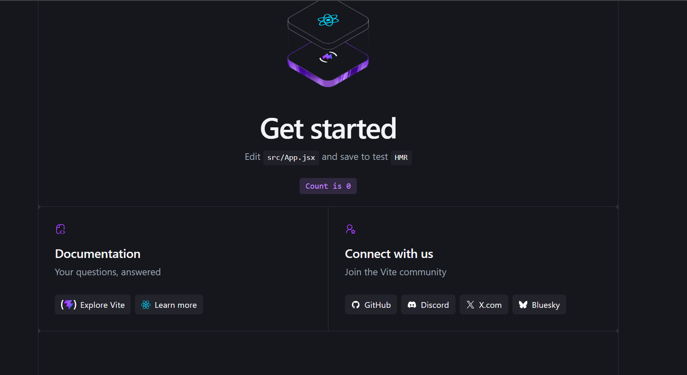
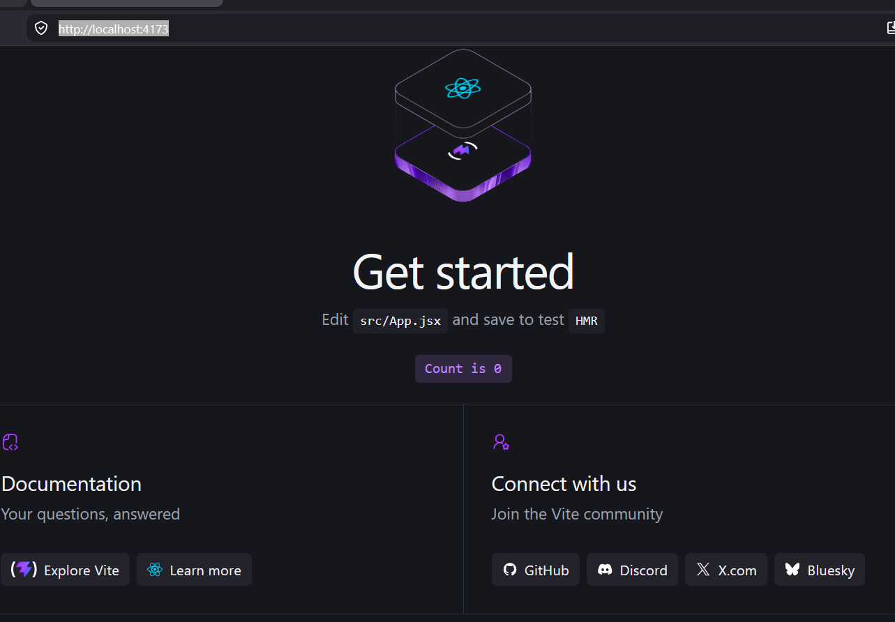

# Zepto-Quick-Commerce
85_Deploy Applications to Kubernetes

Create React Project

# Step 1: Navigate to the project
cd zepto-qucik-commerce 

# Step 2: Create React App with Vite
npm  create vite@latest  frontend --  --template react
 VITE v8.1.5  ready in 1020 ms

  ➜  Local:   http://localhost:5173/
  ➜  Network: use --host to expose
  ➜  press h + enter to show help

press r + enter to restart the server
  press u + enter to show server url
  press o + enter to open in browser
  press c + enter to clear console
  press q + enter to quit

  # Step 3: Move into the project
  $ cd frontend

 # Step 4: Install dependencies
  $ npm install

up to date, audited 136 packages in 3s

31 packages are looking for funding
  run `npm fund` for details

found 0 vulnerabilities

# Step 5: Install additional packages
npm  install react-router-dom axios  bootstrap react-icons
added 32 packages, and audited 168 packages in 13s

40 packages are looking for funding
  run `npm fund` for details

2 high severity vulnerabilities

To address all issues, run:
  npm audit fix

Run `npm audit` for details.

Verify Installation
npm  run dev
> frontend@0.0.0 dev
> vite

12:24:35 PM [vite] (client) Re-optimizing dependencies because lockfile has changed

  VITE v8.1.5  ready in 675 ms

  ➜  Local:   http://localhost:5173/
  ➜  Network: use --host to expose
  ➜  press h + enter to show help

Verify Installation
 npm  run dev

  Expected ouput:
  Local 
  http://localhost:5173/

# Install Bootstrap
main src/App.jsx
online Adding 
import 'bootstrap/dist/css/bootstrap.min.css';

 # Environment variable 
 VITE_API_URI=http://localhost:5000/api

 
# Step 1: Install React Router
npm install react-router-dom

# Verify it is install
npm list react-router-dom

# Step 4: Create route.jsx
Create
This file contains all applications routes
src/route.jsx

# API Layer
Create 
services/api.js

# Local Testing 
$ npm  run dev
 VITE v8.1.5  ready in 538 ms

  ➜  Local:   http://localhost:5173/
  ➜  Network: use --host to expose
  ➜  press h + enter to show help

$ npm run build
> frontend@0.0.0 build
> vite build

vite v8.1.5 building client environment for production...
✓ 20 modules transformed.
computing gzip size...
dist/index.html                   0.45 kB │ gzip:  0.29 kB
dist/assets/react-CHdo91hT.svg    4.12 kB │ gzip:  2.06 kB
dist/assets/vite-BF8QNONU.svg     8.70 kB │ gzip:  1.60 kB
dist/assets/hero-CLDdwZDr.png    13.05 kB
dist/assets/index-DykytF2W.css    4.10 kB │ gzip:  1.47 kB
dist/assets/index-m4QzboyB.js   193.35 kB │ gzip: 60.67 kB

$ npm run preview
> frontend@0.0.0 preview
> vite preview

  ➜  Local:   http://localhost:4173/
  ➜  Network: use --host to expose
  ➜  press h + enter to show help

http://localhost:4173/

# Git Workflow
Create a feature branch
$ git checkout -b feature/frontend
RAVINDRA@Hello MINGW64 /d/GitHub-Actions/Zepto-Quick-Commerce (feature/frontend)

$ git status 

$ git add .

$ git commit -m "Develop React Frontend for Zepto Quick Commerce"

 git push origin feature/frontend
+++++++++++++++++++++++++++++
# Task-3  Part 3: Develop the Node.js Backend APIs

scripts/backend-folder.ps-1 create new file 

$ cd backend
$  D:\GitHub-Actions\Zepto-Quick-Commerce\scripts\backend-folder.ps1

==========================================
 Creating Backend Folder Structure
==========================================

Creating folders...
[SKIPPED] Folder : config
[SKIPPED] Folder : controllers
[SKIPPED] Folder : middleware
[SKIPPED] Folder : models
[SKIPPED] Folder : routes
[SKIPPED] Folder : utils

Creating files...
[CREATED] File   : config\db.js
[CREATED] File   : config\jwt.js
[CREATED] File   : controllers\authController.js
[CREATED] File   : controllers\productController.js
[CREATED] File   : controllers\cartController.js
[CREATED] File   : controllers\orderController.js
[CREATED] File   : controllers\userController.js
[CREATED] File   : middleware\authMiddleware.js
[CREATED] File   : middleware\errorMiddleware.js
[CREATED] File   : middleware\validateMiddleware.js
[CREATED] File   : models\User.js
[CREATED] File   : models\Product.js
[CREATED] File   : models\Cart.js
[CREATED] File   : models\Order.js
[CREATED] File   : routes\authRoutes.js
[CREATED] File   : routes\productRoutes.js
[CREATED] File   : routes\cartRoutes.js
[CREATED] File   : routes\orderRoutes.js
[CREATED] File   : routes\userRoutes.js
[CREATED] File   : utils\response.js
[CREATED] File   : utils\logger.js
[SKIPPED] File   : app.js
[CREATED] File   : server.js
[SKIPPED] File   : package.json
[CREATED] File   : .env.example
[SKIPPED] File   : Dockerfile
[CREATED] File   : .gitignore

==========================================
 Backend Folder Structure Ready!
==========================================
Step 1: Create Backend Folder 
mkdir backend 
cd backend

Step 2: Initialize Node Project
npm init- y it is not working 
Delete package.json  and try once again

npm init- y
Wrote to D:\GitHub-Actions\Zepto-Quick-Commerce\backend\package.json:

{
  "name": "backend",
  "version": "1.0.0",
  "description": "",
  "main": "app.js",
  "scripts": {
    "test": "echo \"Error: no test specified\" && exit 1",
    "start": "node server.js"
  },
  "keywords": [],
  "author": "",
  "license": "ISC",
  "type": "commonjs"
}

# Step 3: Install Required Packages
npm install express mysql dotenv cors helmet morgan jsonwebtoken express-validator

added 106 packages, and audited 107 packages in 12s

31 packages are looking for funding
  run `npm fund` for details

found 0 vulnerabilities

Development Dependency 
npm install --save-dev nodemon
added 25 packages, and audited 132 packages in 4s

36 packages are looking for funding
  run `npm fund` for details

found 0 vulnerabilities

# Step 5: Create Folder Structure 
mkdir config controllers models routes utils

touch app.js  server.js

Step 6: Configure Express (app.js)
const express = require("express");
const cors = require("cors");
const helmet = require("helmet");
const morgan = require("morgan");

const app = express();

// Middleware
app.use(cors());
app.use(helmet());
app.use(morgan("dev"));
app.use(express.json());

// Default Route
app.get("/", (req, res) => {
    res.json({
        message: "Zepto Quick Commerce API Running"
    });
});

module.exports = app;

# Step 6: Configure Express (app.js)
const express = require("express");
const cors = require("cors");
const helmet = require("helmet");
const morgan = require("morgan");

const app = express();

// Middleware
app.use(cors());
app.use(helmet());
app.use(morgan("dev"));
app.use(express.json());

// Default Route
app.get("/", (req, res) => {
    res.json({
        message: "Zepto Quick Commerce API Running"
    });
});

module.exports = app;

# Step 7: Create server.js
require("dotenv").config();

const app = require("./app");

const PORT = process.env.PORT || 5000;

app.listen(PORT, () => {
    console.log(`Server running on port ${PORT}`);
});

Step 8: Create Environment File
Create .env.example
PORT=5000

DB_HOST=localhost
DB_PORT=3306
DB_USER=root
DB_PASSWORD=password
DB_NAME=zepto

JWT_SECRET=mysecretkey

Step 9: Database Connection
config/db.js

Step 10: Authentication Flow

                User Login
                     │
                     ▼
          Email & Password
                     │
                     ▼
        Database Verification
                     │
                     ▼
             Generate JWT
                     │
                     ▼
             Return Token
                     │
                     ▼
          Frontend Stores Token
                     │
                     ▼
         Future Requests Include Token

JWT Protected APIs
+----------------------+
|      User Login      |
+----------------------+
           │
           ▼
+----------------------+
|  Email & Password    |
+----------------------+
           │
           ▼
+----------------------+
| Database Verification|
+----------------------+
           │
           ▼
+----------------------+
|     Generate JWT     |
+----------------------+
           │
           ▼
+----------------------+
|    Return Token      |
+----------------------+
           │
           ▼
+----------------------+
| Frontend Stores JWT  |
+----------------------+
           │
           ▼
+----------------------+
| Future Requests Send |
| Authorization Header |
| Bearer <JWT_TOKEN>   |
+----------------------+

# Product API
product-api-flow/
│
├── frontend/
│   ├── react-ui/
│   ├── components/
│   ├── pages/
│   ├── services/
│   │   └── productService.js
│   └── package.json
│
├── backend/
│   ├── controllers/
│   │   └── ProductController.js
│   ├── routes/
│   ├── models/
│   ├── services/
│   ├── config/
│   └── server.js
│
├── database/
│   ├── mysql/
│   ├── schema.sql
│   └── seed.sql
│
├── api/
│   └── products.http
│
├── docs/
│   └── Product_API_Flow.md
│
├── architecture/
│   └── Product_API_Flow.png
│
├── docker/
│   ├── Dockerfile
│   └── docker-compose.yml
│
├── kubernetes/
│   ├── deployment.yaml
│   ├── service.yaml
│   └── ingress.yaml
│
├── .github/
│   └── workflows/
│       └── ci-cd.yml
│
├── README.md
└── .gitignore

# Backend APIs
backend-request-flow/
│
├── browser/
│   └── request.http
│
├── routes/
│   └── productRoutes.js
│
├── controllers/
│   └── ProductController.js
│
├── models/
│   └── ProductModel.js
│
├── database/
│   ├── mysql/
│   ├── schema.sql
│   └── seed.sql
│
├── services/
│   └── ProductService.js
│
├── middleware/
│   ├── authMiddleware.js
│   └── errorHandler.js
│
├── config/
│   └── db.js
│
├── server.js
├── package.json
└── README.md

The image shows a section titled **"Testing APIs"** with a checklist of API endpoints to test and some verification steps.

Transcribed text:

### Testing APIs

Use **Postman** to test:

* Register
* Login
* Products
* Cart
* Orders
* Profile

Verify:

* Responses use proper HTTP status codes (200, 400, 401, 404, etc.)
* Ask ChatGPT: Start writing
* JWT authentication for protected endpoints

The last line, **"JWT authentication for protected endpoints"**, is highlighted in blue, indicating it is selected.

